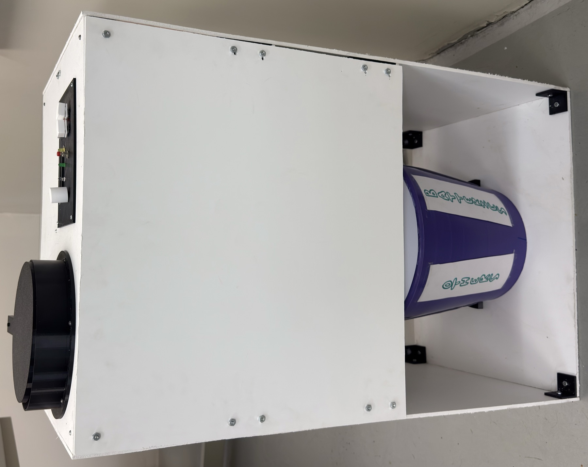
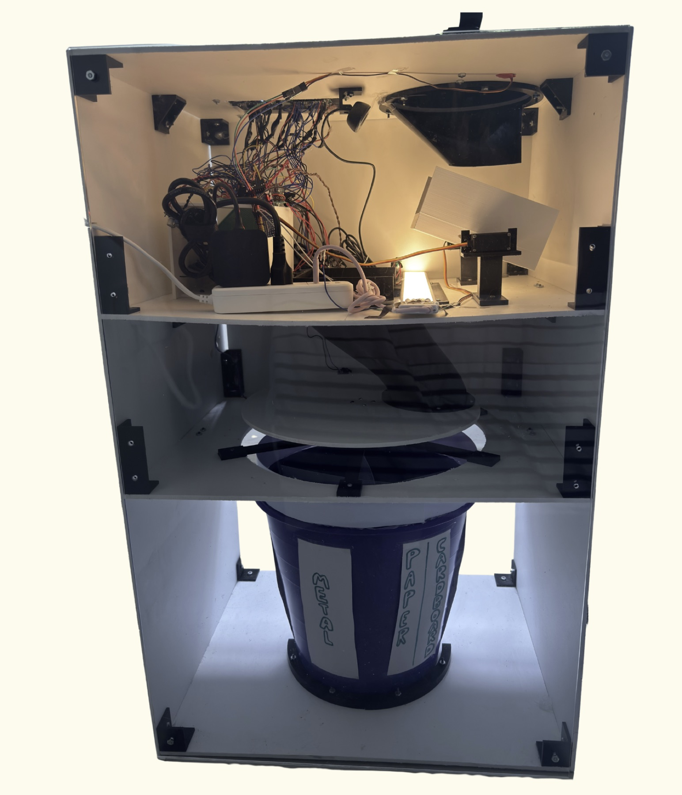
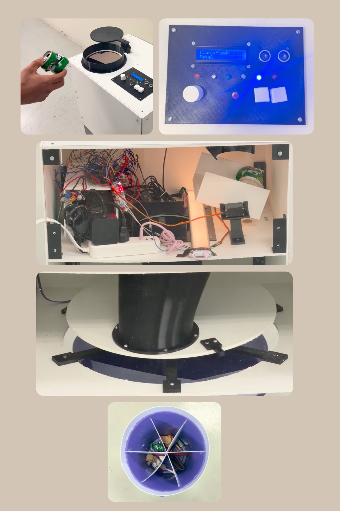
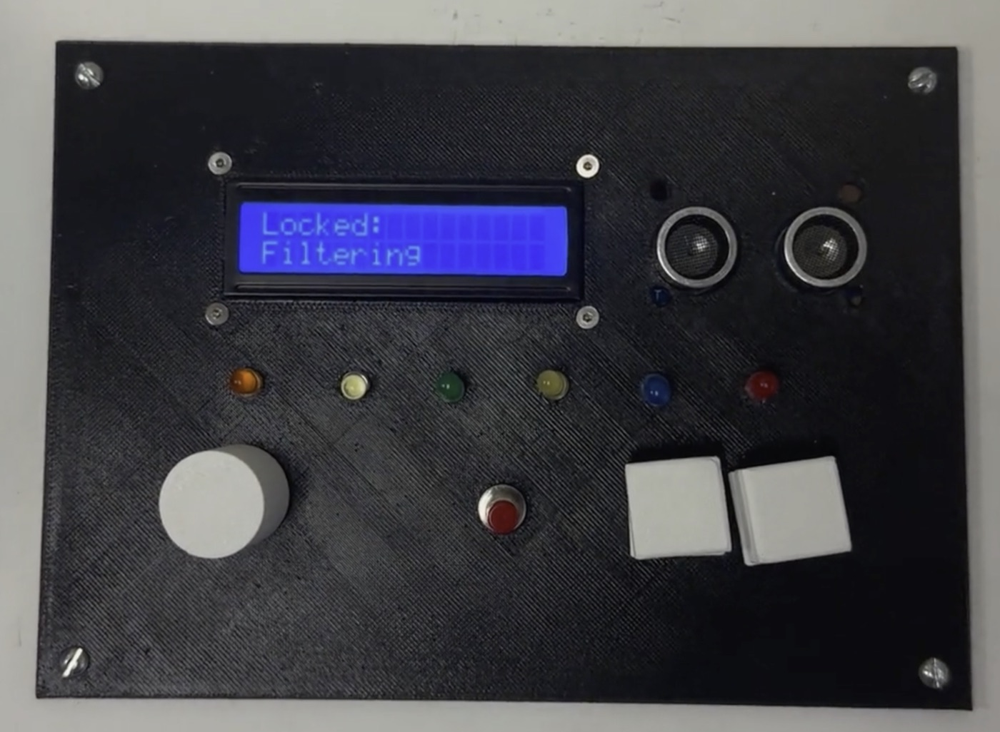
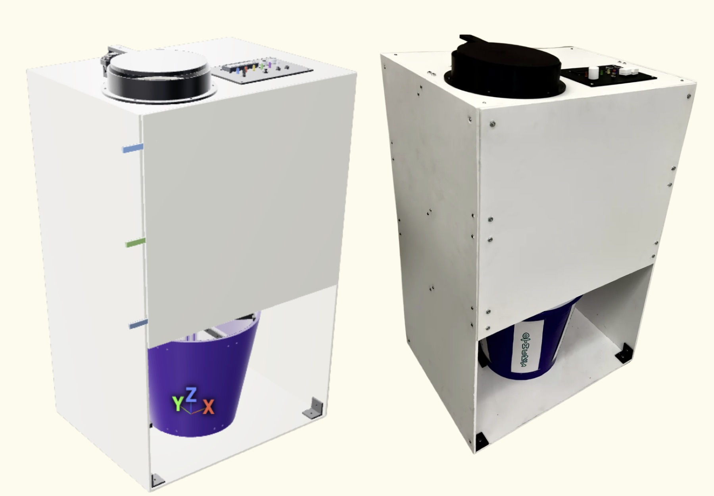

# R3Bin: Intelligent Waste Sorting System


R3Bin is a complete physical prototype designed to automate waste classification through embedded control, local computer vision, real-time actuation, and custom mechanical sorting. It identifies, sorts, and stores waste objects by integrating an ATmega16 real-time controller, a Raspberry Pi 5 computer-vision subsystem, TensorFlow Lite image classification, UART communication, I2C/TWI communication, EEPROM persistence, MG996R servo control, NEMA 17 stepper motor positioning, sensors, a custom user interface, and a physical structure manufactured through 3D printing and laser-cut fabrication.

R3Bin is not a simulation, mockup, or CAD-only concept. It combines embedded firmware, computer vision, AI inference, mechanical design, manufacturing, real-time control, and hardware/software integration into a functioning system that was built, assembled, calibrated, tested, and demonstrated as a working prototype.

**Demo:** [R3Bin final demo video](https://youtu.be/eC5EfTwEhFM)

## Technologies

| Domain | Technologies |
| --- | --- |
| Embedded control | ATmega16, AVR-GCC, direct register-level C firmware, GPIO, ADC |
| Computer vision | Raspberry Pi 5, Logitech C270 webcam, OpenCV |
| AI inference | TensorFlow Lite / LiteRT, Teachable Machine exported model |
| Communication | UART serial protocol, I2C/TWI bus |
| Persistence | ATmega16 EEPROM for game high score and per-category statistics |
| Actuation | PCA9685 PWM driver, MG996R servos, NEMA 17 stepper motor |
| Motor control | DRV8825 stepper driver, KW11 homing switch, calibrated sector positioning |
| User interface | 16x2 LCD, category LEDs, potentiometer, push buttons, active buzzer |
| Mechanical design | ForgeCAD, 3D printing, laser-cut PVC/acrylic, PETG/PLA parts, styrene dividers |

## Project Visuals

### Complete Physical Prototype



Complete assembled R3Bin prototype with the user-facing interface, inlet mechanism, PVC/acrylic structure, and storage body.

### Internal Mechanism Through Acrylic



Rear acrylic view showing the internal sorting path, actuation mechanisms, rotating disk area, and storage region.

### Waste Sorting Process



End-to-end sorting sequence from object insertion and photo booth capture to classification, disk positioning, and storage.

### User Interface and Embedded Control



User-facing control panel with LCD feedback, mode selector, category LEDs, buttons, and ultrasonic detection.

### CAD Model vs Physical Build



ForgeCAD model compared with the final physical prototype, showing the transition from parametric design to manufactured system.

## Overview

R3Bin automates the full waste-sorting cycle:

1. A user selects an operating mode with a potentiometer.
2. An ultrasonic sensor detects the user's hand and locks the selected mode.
3. A servo-driven inlet lid opens and receives one object.
4. The object enters an internal photo booth.
5. The ATmega16 requests image classification from the Raspberry Pi 5 over UART.
6. The Raspberry Pi captures an image with a Logitech C270 webcam and runs a TensorFlow Lite model locally.
7. The Raspberry Pi returns the detected category to the ATmega16.
8. The ATmega16 drives the NEMA 17 sorting disk to the selected sector.
9. Servo mechanisms release the object into the matching storage compartment.
10. EEPROM-backed counters and game high score are updated.

The final prototype classifies waste into six categories:

- Other
- Plastic
- Paper/cardboard
- Metal
- Organic
- Batteries

## Key Contributions

- Built a complete hardware/software system combining embedded firmware, AI inference, mechanisms, and physical manufacturing.
- Implemented real-time control logic on an ATmega16 using C, direct register configuration, UART, I2C/TWI, ADC, EEPROM, GPIO, and timing routines.
- Integrated Raspberry Pi 5 computer vision using OpenCV, TensorFlow Lite, and a locally trained Teachable Machine model.
- Designed and calibrated actuator sequences for MG996R servos, a PCA9685 PWM driver, a NEMA 17 stepper motor, and a DRV8825 stepper driver.
- Developed ForgeCAD parametric models, 3D-printable parts, laser-cut PVC/acrylic layouts, and physical assembly strategy.
- Validated the complete system with timing, energy, capacity, and classification measurements.

## My Role

My primary contributions focused on embedded systems integration, firmware architecture, hardware interfacing, and system-level integration. I worked on connecting the ATmega16 controller, Raspberry Pi vision subsystem, communication interfaces, and electromechanical sorting mechanisms into a complete working prototype. A major part of my work was making the independent subsystems operate together reliably as a single physical system.

This included work on UART communication, I2C/TWI communication, ATmega16 firmware, EEPROM persistence, operating-mode logic, actuator control, sensor integration, testing, debugging, calibration, and system-level integration between the microcontroller, Raspberry Pi, computer vision subsystem, and mechanical mechanisms.

Specific areas of ownership included:

- ATmega16 firmware structure and mode-state logic.
- UART protocol between ATmega16 and Raspberry Pi.
- PCA9685 servo control through I2C/TWI.
- EEPROM persistence for statistics and game high score.
- Potentiometer mode selection through ADC.
- LCD/LED user-feedback logic.
- NEMA 17 homing and sector positioning with the KW11 switch.
- Physical calibration of servos, disk movement, object release, and timing.
- Integration testing across firmware, camera classification, motors, and mechanical structure.

## Collaboration

R3Bin was developed as a team project rather than a solo build.

Team members:

- Ricardo Morán Ávila
- Joaquín Ruenes Hernández
- Rafael Tello Arenas

All team members contributed to the final prototype across design, manufacturing, assembly, testing, documentation, and demonstration.

## System Architecture

R3Bin separates responsibilities across real-time control, AI inference, user interaction, and mechanical execution.

| Subsystem | Responsibility |
| --- | --- |
| ATmega16 real-time controller | Main state machine, mode logic, actuator sequencing, LCD/LED updates, EEPROM storage, sensor polling |
| Raspberry Pi 5 vision subsystem | Camera capture, TensorFlow Lite inference, label normalization, UART response |
| TensorFlow Lite classification pipeline | Local image classification into six waste categories plus no-object detection |
| UART communication layer | Request/response protocol between ATmega16 and Raspberry Pi |
| PCA9685 servo subsystem | PWM generation for MG996R servo actuators through I2C/TWI |
| DRV8825 stepper subsystem | Step/direction control for NEMA 17 disk positioning |
| LCD/LED user interface | Mode feedback, classification result, score/stats display, category indication |
| EEPROM persistence | Stores high score and per-category object counts after power loss |
| Mechanical sorting structure | Laser-cut PVC/acrylic body, printed mechanisms, rotating disk, photo booth, bucket storage |

## Validation Results

| Metric | Result |
| --- | ---: |
| Average boot time | 6.18 s |
| Average Raspberry Pi boot time | 10.02 s |
| Average classification time | 2.18 s |
| Average full sorting cycle time | 13.56 s |
| Overall classification accuracy | 80% |
| Maximum object size | 8 cm x 8 cm x 8 cm |
| Maximum object weight | 300 g |
| Minimum object weight | 5 g |
| Total storage capacity | 15 L |
| Capacity per compartment | 2.5 L |
| Peak measured consumption | 26.6 VA / 17.5 W |

Classification validation reported in the final presentation:

| Category | Correct / Tested |
| --- | ---: |
| Plastic | 10 / 10 |
| Paper/cardboard | 8 / 10 |
| Metal | 8 / 10 |
| Organic | 8 / 10 |
| Batteries | 6 / 10 |

## Hardware Stack

- ATmega16 microcontroller
- Raspberry Pi 5
- Logitech C270 USB webcam
- PCA9685 16-channel PWM servo driver
- MG996R servo motors
- NEMA 17 17HS4023 stepper motor
- DRV8825 stepper motor driver
- KW11 limit switch for disk homing
- HC-SR04 ultrasonic sensor
- 16x2 parallel LCD
- Category LEDs, active buzzer, potentiometer, and push buttons
- 12 V / 5 A AC/DC supply with step-down conversion for 5 V subsystems
- 5 mm foamed PVC structure
- Acrylic rear panel
- PETG/PLA 3D printed parts
- Manually cut 30 pt styrene divider sheets for final bucket compartments

## Software Stack

- C firmware for ATmega16
- AVR-GCC toolchain and Makefile-based builds
- Direct register-level peripheral control
- UART serial protocol
- I2C/TWI driver for PCA9685
- EEPROM storage through AVR libraries
- Python on Raspberry Pi 5
- OpenCV camera capture
- TensorFlow Lite / LiteRT inference
- Teachable Machine model export
- ForgeCAD parametric CAD scripts

## Operating Modes

### Stats Mode

Stats Mode displays the number of classified objects stored in each category. Counts are saved in EEPROM and survive power loss. A button can reset the stored counts after the bins are emptied.

### Filtering Mode

Filtering Mode performs the standard automatic classification cycle. It opens the lid, captures an image, receives the AI category, rotates the disk to the correct sector, releases the object, updates the corresponding count, and returns to idle.

### Game Mode

Game Mode adds an educational interaction layer. The system asks the user to insert a specific category using LEDs and LCD prompts. The Raspberry Pi classifies the inserted object, the ATmega16 checks whether it matches the requested category, and the game score/high score are updated in EEPROM.

## Firmware Architecture

The main firmware is implemented in [`firmware/atmega16.c`](firmware/atmega16.c). It is structured around a polling-based state machine rather than an RTOS.

Core firmware responsibilities:

- Hardware initialization
- LCD messaging
- Potentiometer-based mode selection
- Ultrasonic hand detection
- Servo sequencing through PCA9685
- UART request/response communication with Raspberry Pi
- NEMA 17 homing and sector positioning
- Category LED indication
- EEPROM high-score and statistics storage
- Game-mode scoring logic
- Stats-mode display and reset logic

Focused hardware test programs were used during development for UART, LCD, I2C/PCA9685, KW11, NEMA calibration, and servo-channel validation. This repository keeps only the final working firmware source in `firmware/atmega16.c`.

## Computer Vision Pipeline

The Raspberry Pi script is implemented in [`raspberry/r3bin_uart_camera_capture.py`](raspberry/r3bin_uart_camera_capture.py).

Pipeline:

1. Wait for `CAPTURE` over `/dev/serial0`.
2. Capture a frame from the Logitech C270 webcam.
3. Preprocess the image for the TensorFlow Lite model input size and dtype.
4. Run local inference.
5. Normalize the output label into the ATmega16 category protocol.
6. Return the result over UART.

If confidence is below the selected threshold, the object is classified as `OTHER` unless the model explicitly detects `NO_OBJECT`.

## Communication Protocols

### ATmega16 to Raspberry Pi UART

- Baud rate: 9600
- ATmega16 TX to Raspberry Pi RX uses a voltage divider.
- Raspberry Pi TX to ATmega16 RX is connected directly.
- Both systems share common ground.

Messages:

```text
ATmega16 -> Raspberry Pi: CAPTURE
Raspberry Pi -> ATmega16: METAL | ORGANIC | PAPER | PLASTIC | BATTERIES | OTHER | NO_OBJECT
```

### ATmega16 to PCA9685 I2C/TWI

- I2C frequency: 100 kHz
- PCA9685 servo PWM frequency: 50 Hz
- Used to drive MG996R servo channels for the inlet lid and photo booth mechanism.

### ATmega16 to DRV8825

- STEP/DIR/ENABLE control from GPIO pins.
- KW11 switch provides the disk home reference.
- Physical sector positions were calibrated experimentally.

## Mechanical Design

The physical structure is a vertical rectangular bin approximately 500 mm wide, 400 mm deep, and 800 mm tall.

Mechanical features:

- Laser-cut 5 mm PVC body panels
- Transparent acrylic rear panel for viewing the internal process
- Servo-driven inlet lid
- Internal photo booth for stable image capture
- Rotating disk and guide path for sorting
- NEMA 17 support hub and receiver socket
- Custom printed holders, collars, supports, brackets, and guides
- Removable bucket divided into six compartments
- Final bucket divisions made with manually cut styrene sheets for simplicity and reduced material use

ForgeCAD was used to design and iterate the physical structure, validate clearances, generate print kits, and produce manufacturing layouts.

## Engineering Challenges

- Stabilizing objects for reliable image capture inside a compact bin volume.
- Coordinating Raspberry Pi inference latency with ATmega16 real-time actuator control.
- Designing a UART protocol robust enough for repeated physical testing.
- Calibrating servo motion with real mechanical load and linkage tolerances.
- Calibrating the NEMA 17 disk positioning against asymmetric physical load.
- Debugging shared grounds, reset behavior, UART level shifting, and programmer wiring.
- Reducing PETG usage by replacing overcomplicated printed bucket dividers with manually cut styrene sheets.
- Preserving maintainability while integrating electronics, mechanics, and user interaction in a constrained enclosure.

## Demo

- Final demo video: [https://youtu.be/eC5EfTwEhFM](https://youtu.be/eC5EfTwEhFM)
- Final presentation: [`docs/final-presentation.pdf`](docs/final-presentation.pdf)

The full video is hosted externally so the repository stays lightweight and GitHub-compatible.

## Repository Structure

```text
R3Bin/
├── firmware/       # Final ATmega16 firmware and Makefile
├── raspberry/      # Raspberry Pi vision + UART script, labels, TFLite model
├── forgecad/       # Parametric ForgeCAD model files and CAD reference assets
├── print-kits/     # Exported 3MF files for 3D printed parts
├── manufacturing/  # PVC/acrylic cutting files and laser-cut documentation
├── docs/           # Final presentation and technical documentation
└── README.md       # Portfolio overview
```

## Build and Run

Firmware build example:

```bash
cd firmware
make compile FILE=atmega16.c
make program FILE=atmega16.c
```

Raspberry Pi vision service example:

```bash
python3 raspberry/r3bin_uart_camera_capture.py
```

ForgeCAD model:

```bash
forgecad run forgecad/smart-bin-layout.forge.js
```

## Notes

The final physical prototype uses manually cut styrene dividers inside the bucket. Some ForgeCAD print kits represent earlier mechanical iterations and are preserved to document the engineering process, but they were not all used in the final assembly.
